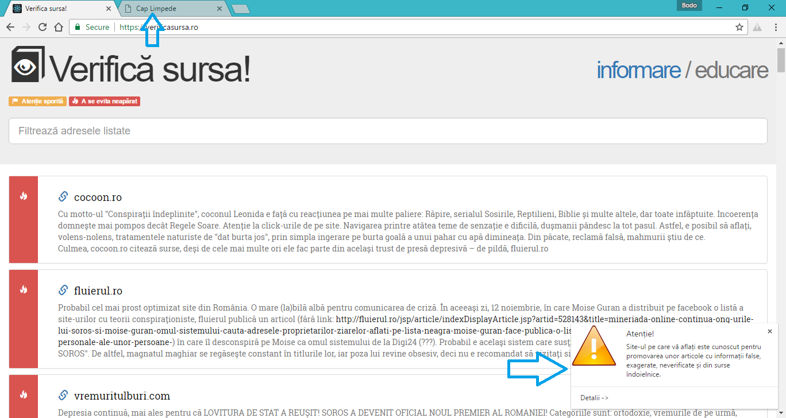

# VerificaSursa.ro Chrome Extension

Checks the sites you visit in the Google Chrome browser against VerificaSursa.ro's blacklist of Romanian fake-news websites and alerts upon detecting one. VerificaSursa's website is accessed once per browsing session and the list of bad websites is compiled into a regular expression, that your tabs are matched to locally. So your data (history, page titles etc) is never logged never leaves your browser or computer.

### Installation & Requirments
Clone the repo or download as a zip file and uncompress to a directory. Go to Chrome settings, extensions, load unpacked extension and select the folder that contains the files. You may modify it to your liking, pack it, make it completely block the websites, install it on your mom's computer etc.

### Usage
You will be alerted through a chrome browser notification any time you visit a page on the sites marked on the blacklist. The action button of the notification panel will give you further details (directing you to the VerificaSursa page for that entry) about why that particular website is not a trustworthy source of information.

### To-Do
- Useful html context popup.

### License, disclaimer and known limitations
This is a completely open source project, built on open source modules and licensed under [Apache License 2.0](https://www.apache.org/licenses/LICENSE-2.0.html).
I am not affiliated with the creators and maintainers of VerificaSursa.ro - this plugin accesses their website to get the list of sites once per browsing session and directs the users to their website for further documentation.